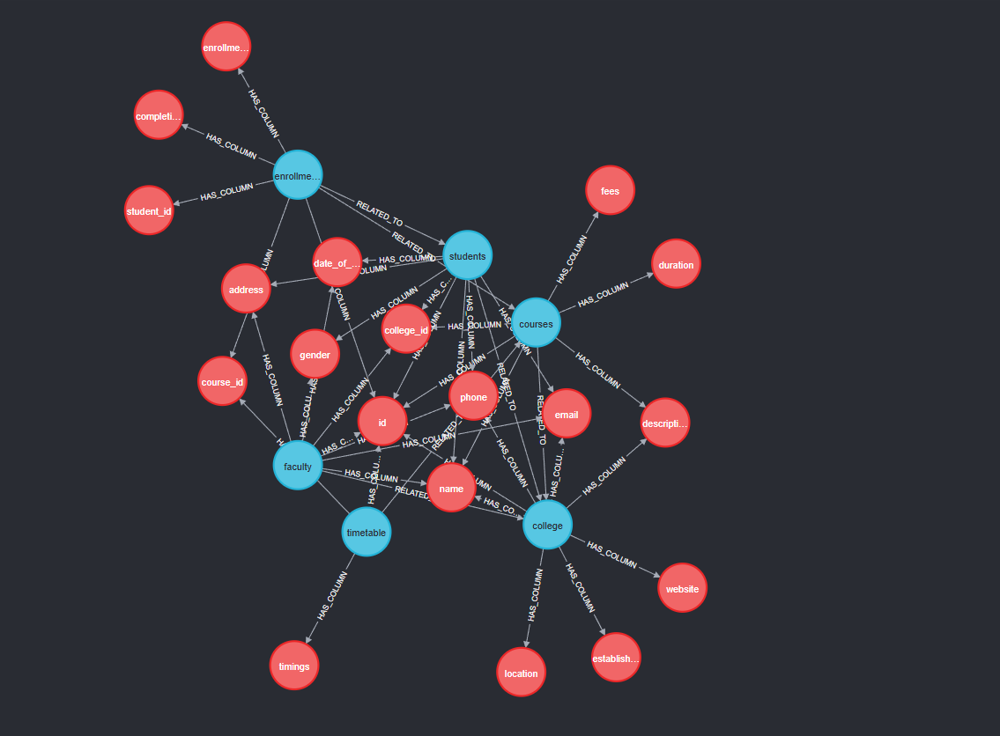

# Hybrid GraphRAG Text-to-SQL Assistant

A high-precision Text-to-SQL engine that uses a **Neo4j Knowledge Graph** to map database schemas and **SQLite** for actual data execution. This architecture allows Large Language Models (LLMs) to navigate massive schemas (1000+ tables) without context window limits by retrieving only the relevant sub-graphs.

## Key Features

* **Hybrid Architecture:**
    * **Neo4j:** Stores the *metadata* (Tables, Columns, Relationships) as a Knowledge Graph.
    * **SQLite:** Stores the *actual data* rows.
    * **Gemini 2.5 Pro:** The reasoning engine that navigates the graph and writes SQL.
* **GraphRAG Retrieval:** Instead of feeding the LLM all 1000 tables, the system "hunts" through the graph to find only the relevant tables and their foreign key neighbors.
* **"Glass Box" UI:** The Streamlit interface visualizes every step:
    1.  **Context Retrieval:** Shows exactly which tables the AI found in the graph.
    2.  **SQL Generation:** Shows the raw SQL query generated.
    3.  **Execution:** Shows the raw JSON data returned from the database.
* **System Tracing:** Automatically logs all reasoning steps, SQL queries, and results to `system_trace.log` for debugging and auditing.
* **Hallucination Protection:** The system uses strict Schema Injection, ensuring the LLM only writes SQL for tables that actually exist.

## Folder Structure

```plaintext
sql_chat_project/
│
├── .env                       # API Keys (Google Gemini, Neo4j Config)
├── requirements.txt           # Python dependencies
├── docker-compose.yml         # Neo4j Database container definition
├── schema.sql                 # The original SQL DDL (Table definitions)
│
├── setup_db.py                # Script 1: Creates SQLite DB & loads data
├── setup_schema_graph.py      # Script 2: Reads SQLite & builds Neo4j Graph
├── app.py                     # Main Streamlit Frontend
│
├── system_trace.log           # Log file (Created automatically on run)
│
└── src/
    ├── __init__.py
    └── inference.py           # The Hybrid Query Engine (Logic Core)
```
<a href="url"></a>

*Visual representation of the Schema Knowledge Graph in Neo4j (Tables in Blue, Columns in Red).*
